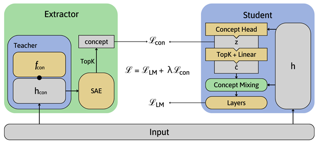
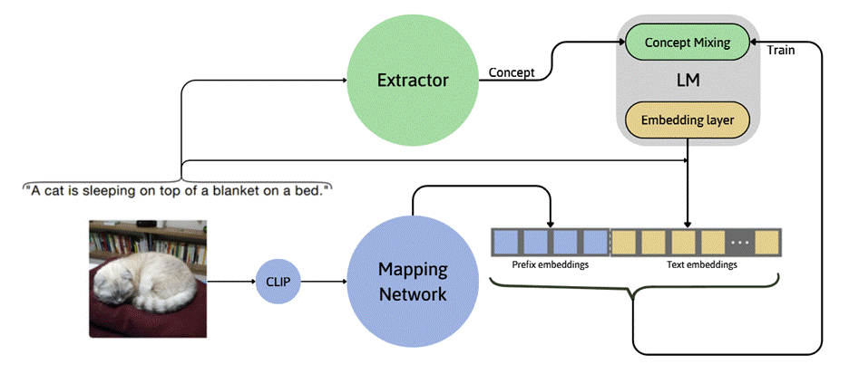

# Evaluating Methods For Applying Large Concept Model To Image Captioning 👁️📜🖋️
[[paper]](paper.pdf) [[zenodo]]([paper.pdf](https://zenodo.org/records/19276839)) [[model]](https://huggingface.co/Anshler/clip-cocomix)

## Abstract

This thesis investigates the application of [Large Concept Models](https://github.com/facebookresearch/RAM/tree/main/projects/cocomix) (LCMs) to image captioning, a task requiring both visual recognition and linguistic reasoning. Unlike Transformer-based captioners that optimize token likelihood, LCMs internalize high-dimensional concept representations, enabling richer semantic abstraction. We integrate LCMs into a prefix-based captioning framework and introduce Prefix Concept Extraction (PCE), which converts image embeddings into pseudo-tokens for explicit cross-modal alignment. Experiments on Flickr30k demonstrate that LCM-based captioners consistently outperform GPT-2 baselines under frozen language model training, achieving higher BLEU, METEOR, ROUGE, CIDEr, and BERTScore metrics. While GPT-2 remains competitive when fine-tuned, LCM variants show stronger semantic fidelity and generalization. Finally, we implement the proposed models as an extension for Stable Diffusion WebUI, enabling practical deployment for dataset creation and real-world usage. These findings highlight concept-based modeling as a promising alternative to sequence likelihood optimization in multimodal learning.

## Architecture





## Dataset

This model was trained on the [Flickr30k](https://www.kaggle.com/datasets/eeshawn/flickr30k) dataset

## Evaluation

* Frozen LM setting

| Model         | BLEU-1 | BLEU-2 | BLEU-3 | BLEU-4 | METEOR | ROUGE | CIDEr | BERTScore |
|--------------|--------|--------|--------|--------|--------|-------|-------|-----------|
| GPT-2        | 0.5245 | 0.3516 | 0.2285 | 0.1460 | 0.1961 | 0.4844 | 0.4384 | 0.8922 |
| Cocomix      | 0.5847 | 0.4016 | 0.2647 | 0.1737 | 0.2033 | 0.4982 | 0.4660 | 0.8953 |
| Cocomix+PCE  | 0.6221 | 0.4267 | 0.2822 | 0.1841 | 0.2052 | 0.5060 | 0.4587 | 0.8967 |

Cocomix+PCE achieves the best results in the frozen language model setting, demonstrating the benefit of Prefix Concept Extraction for semantic alignment and caption quality.

## Training

Use the Notebook [FSB_Capstone_ClipCap.ipynb](FSB_Capstone_ClipCap.ipynb). It can be run on Google Colab. Replace all the folder name with your actual folders, else it won't work.

__Important note__: The code is for training the image captioner from scratch, if you want to finetune the current model, try modify the code yourself.

Also, in this project, we used a custom GPT model. Training pipeline from [cocomix repo](https://github.com/facebookresearch/RAM/tree/main/projects/cocomix), you can just use the normal gpt-2 or anything else.

## Inference

We create a _[Stable diffusion WebUI](https://github.com/AUTOMATIC1111/stable-diffusion-webui) extension_ to interact with the model locally. Load from this repo [Anshler/Cocomix_sd_extension](https://github.com/Anshler/Cocomix_sd_extension)

## Models
Model weights are published on Huggingface
<a> </a> [Anshler/clip-cocomix](https://huggingface.co/Anshler/clip-cocomix)

CLIP model used is ViT-L-14

## Citation

```bibtex
@misc{huynh2026evaluating,
  author       = {Minh Huynh, T.},
  title        = {Evaluating Methods For Applying Large Concept Model To Image Captioning},
  year         = {2026},
  publisher    = {Zenodo},
  doi          = {10.5281/zenodo.19276839},
  url          = {https://doi.org/10.5281/zenodo.19276839}
}
```
